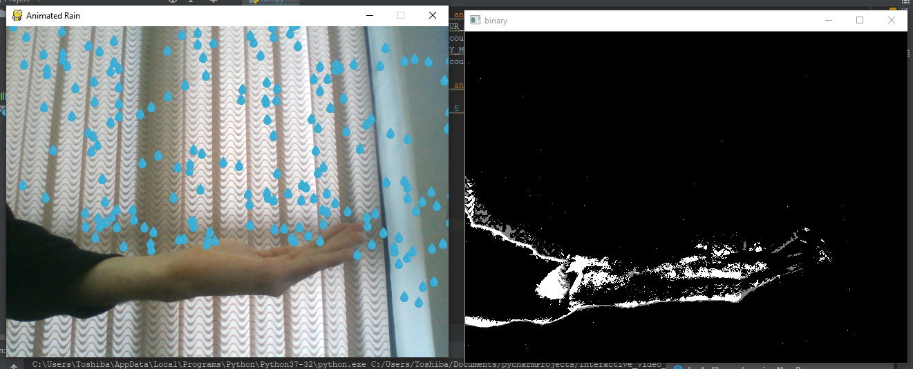

# Interactive Video Processing
In this project, I wanted to make video interactive. The scenario is: drops are falling until they reach the objects. 

To achieve that, we need to do detect objects that, we do it by background subtraction.

## Output
You can see the output below:

